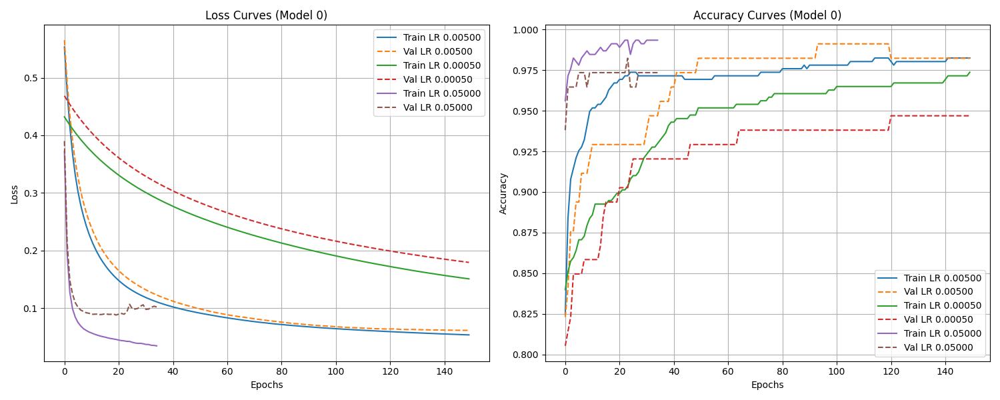
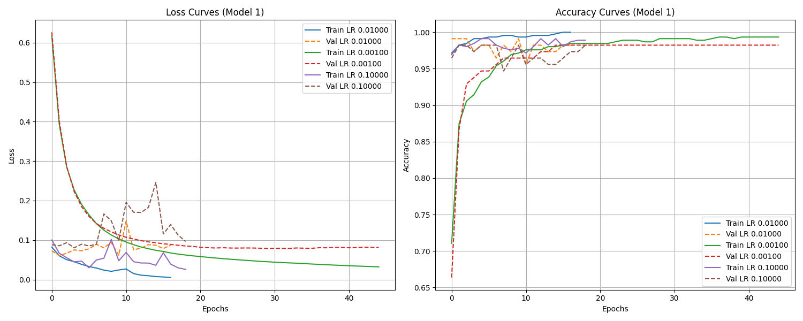

# Multilayer Perceptron (MLP) From Scratch

<div align="center">


</div>

---

## Table of Contents

- [Overview](#overview)
- [Learning Objectives](#learning-objectives)
- [Dataset](#dataset)
- [Data Preprocessing](#data-preprocessing)
- [Model Architecture](#model-architecture)
- [Training Pipeline](#training-pipeline)
- [Machine Learning Concepts Implemented](#machine-learning-concepts-implemented)
- [Metrics Implemented](#metrics-implemented)
- [Early Stopping](#early-stopping)
- [Visualization](#visualization)
- [Project Structure](#project-structure)
- [Installation](#installation)
- [Usage](#usage)
- [Makefile Commands](#makefile-commands)
- [Training Example (training2)](#training-example-training2)
- [Results](#results)
- [Technologies](#technologies)
- [Author](#author)

---

## Overview

This project is a complete implementation of a **Multilayer Perceptron (MLP)** built entirely from scratch using only Python and NumPy.

The purpose is to understand the mathematical and computational foundations of neural networks by implementing every core component manually, without ML frameworks like TensorFlow or PyTorch.

The model is trained on the **Breast Cancer Wisconsin Dataset** to classify tumors as:
- **Malignant (M)**
- **Benign (B)**

---

## Learning Objectives

- Understand how neural networks work internally
- Implement forward and backward propagation
- Build optimization algorithms from scratch
- Apply machine learning evaluation metrics
- Design and train a full ML pipeline

---

## Dataset

### Source

The dataset used in this project is the provided file in the repository:

```text
data.csv
```

Binary classification:

| Label | Description |
|-------|-------------|
| M     | Malignant   |
| B     | Benign      |

### Train/Test Split

```text
data_training.csv
data_test.csv
```

---

## Data Preprocessing

- Train / Validation / Test split
- Z-score normalization:

$$z = \frac{x - \mu}{\sigma}$$

---

## Model Architecture

Configurable via CLI:

```bash
--layer 16 16
```

Structure:

```
Input → Hidden Layers → Output
```

---

## Training Pipeline

```
Data → Normalize → Forward → Loss → Backprop → Update → Evaluate
```

---

## Machine Learning Concepts Implemented

### Core

- Fully connected neural networks
- Forward propagation
- Backpropagation
- Weight initialization

### Optimization

- Gradient Descent
- Adam optimizer
- Mini-batch training

### Activation Functions

- ReLU
- Sigmoid
- Tanh
- Softmax

### Loss

- Categorical Cross-Entropy

---

## Metrics Implemented

- Accuracy
- Precision
- Recall
- F1 Score

---

## Early Stopping

Stops training when validation loss stops improving, preventing overfitting.

---

## Visualization

Generated in:

```text
curves/
```

Includes:

- Loss curves
- Accuracy curves

---

## Project Structure

```text
.
├── datasets/
├── curves/
├── history_models/
├── functions.py
├── models.py
├── tools.py
├── mlp.py
├── Makefile
├── models.npz
├── results.csv
└── README.md
```

---

## Installation

The easiest way is to use the Makefile.  
`make` creates the virtual environment and installs dependencies.

```bash
git clone https://github.com/davidgomezlandero/mlp-from-scratch.git
cd mlp-from-scratch
make
source venv/bin/activate
```

---

## Usage

### Dataset Preparation

```bash
python mlp.py --dataset data.csv
```

### Train

```bash
python mlp.py --training --layer 16 16 --epochs 100 --batch_size 32 --learning_rate 0.01 --optimization Adam
```

### Predict

```bash
python mlp.py --predict data_test.csv
```

---

## Makefile Commands

```bash
make
make training1
make training2
make clean
make fclean
```

---

## Training Example (training2)

Command:
```bash
make training2
```

Curves saved:
- `curves/curves_arch-30-5-5-2_opt-GD_epochs-150_bs-16_lr-0.005.png`
- `curves/curves_arch-30-16-16-2_opt-Adam_epochs-200_bs-32_lr-0.01.png`

Example curves:




Best validation metrics from your run:
- Validation Accuracy: **0.9912**
- Validation F1: **0.9905**
- Validation Loss: **0.0606**

Prediction evaluation:
- Evaluation Loss (Model 0): **0.0612**
- Evaluation Loss (Model 1): **0.0606**
- Predictions saved to `results.csv`

---

## Results

| Metric   | Score |
|----------|-------|
| Accuracy | ~99%  |
| F1 Score | ~99%  |
| Loss     | ~0.06 |

---

## Technologies

Python · NumPy · Pandas · Matplotlib · Machine Learning · Neural Networks

---

## Author

**David Gómez-Landero López**

[](https://www.linkedin.com/in/david-gomez-landero)